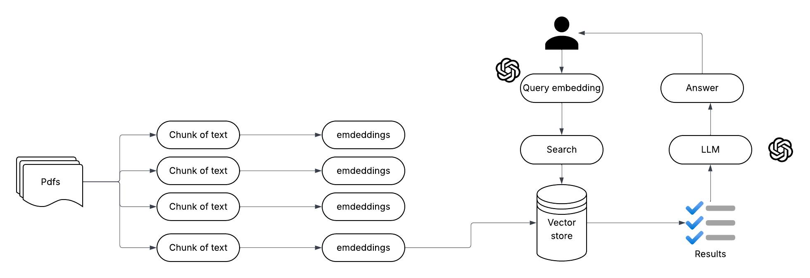

## Introduction
------------
This project is a GenAI-powered document processing system that enables users to interact with the contents of multiple uploaded PDF documents through a conversational interface. It is designed to assist users in efficiently extracting insights from large volumes of text using a natural language interface backed by retrieval-augmented generation (RAG).

The system combines the capabilities of:
1. Document parsing and preprocessing
2. Text chunking and vector embedding generation
3. FAISS vector database for semantic similarity search
4. LangChain conversational retrieval chain
5. LLM (OpenAI's GPT) for natural language interaction
6. Streamlit UI for an interactive web interface

## How It Works
------------



Component Breakdown

- User Interface (Streamlit)

1. Users interact with the system through a chat-based UI.
2. Functionality includes PDF upload, query input, and output rendering.
3. Chat history is retained to support multi-turn conversations.

- Document Processing

1. Uploaded PDFs are parsed using PyPDF2 to extract raw text.
2. The text is split into manageable chunks using LangChain's CharacterTextSplitter, preserving semantic continuity via chunk overlap.

- Embedding Generation

1. The text is split into manageable chunks using LangChain's CharacterTextSplitter, preserving semantic continuity via chunk overlap.
2. Each text chunk is passed through an embedding model (OpenAIEmbeddings) to convert it into a dense vector representation that captures semantic meaning.

- Vector Store (FAISS)

1. The embeddings are stored in a vector database (FAISS).
2. This allows efficient similarity search during retrieval.

- Query Handling

1. User questions are also converted into embeddings.
2. The system performs a similarity search against the vector store to retrieve the top-k most relevant text chunks.

- Language Model Interaction

1. Retrieved chunks + chat history are sent to ChatOpenAI (via LangChain’s ConversationalRetrievalChain).
2. The LLM generates a coherent, context-aware answer based on the question and supporting documents.


- Memory Component

1. ConversationBufferMemory stores past exchanges to support continuity and more natural follow-up responses.


## Dependencies and Installation
----------------------------

1. Clone the repository to your local machine.

2. Install the required dependencies by running the following command:
   ```
   pip install -r requirements.txt
   ```

3. Obtain an API key from OpenAI and add it to the `.env` file in the project directory.
```commandline
OPENAI_API_KEY=your_secrit_api_key
```

## Usage
-----

1. Install the required dependencies and add the OpenAI API key to the `.env` file.

2. Run the `main.py` file using the Streamlit CLI. Execute the following command:
   ```
   streamlit run app.py
   ```

3. The application will launch in your default web browser, displaying the user interface.

4. Load multiple PDF documents into the app by following the provided instructions.

5. Ask questions in natural language about the loaded PDFs using the chat interface.

